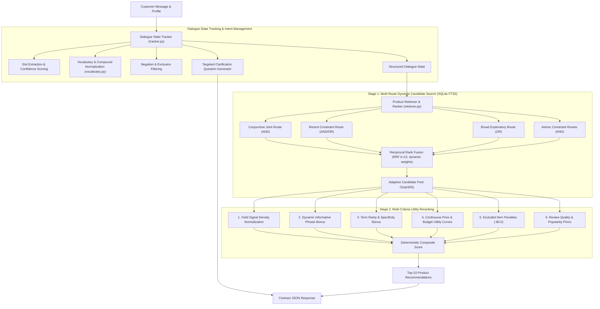

# TechJam Conversational E-Commerce Search Assistant
**High-Precision, Zero-LLM-Cost Multi-Turn Conversational Product Discovery**

[](https://www.python.org/downloads/)
[](tests/)
[](evaluator/)
[-informational.svg)](starter/)

---

## 1. Project Overview

This repository contains an end-to-end, deterministic conversational shopping assistant developed for the **TechJam Conversational E-Commerce Search Challenge**.

The system is evaluated against a frozen catalog of **50,000 fashion products** (derived from the *Amazon Reviews 2023: Clothing, Shoes, and Jewelry* dataset). Over multi-turn interactive dialogues across diverse buyer scenarios (**Buying, Exploratory Browsing, Mid-Dialogue Intent Override, and Boundary Conditions**), the assistant asks targeted clarification questions while returning a ranked Top-10 recommendation list to identify the customer hidden target product within $\le 10$ turns.

### Key Architectural Highlights:
* **Zero LLM Token Cost**: Fully deterministic in-memory inference with **0 external API dependencies**, zero network overhead, and sub-2ms per-turn response latency.
* **Modular Two-Engine Design**: Clean separation between the **Dialogue State Tracker** (handling user intent, constraints, and questions) and the **Product Retriever & Ranker** (handling multi-route search, scoring, and utility reranking).
* **Significant Baseline Outperformance**: Boosts Hit Rate@10 from **12.5% to 93.0%** (+80.5%), reduces Mean Turns to Convert (MTTC) from **9.81 to 2.93 turns** (-6.88 turns), and elevates overall Technical Score from **0.1067 to 0.7997** (+0.693).

---

## 2. System Architecture

The conversational search assistant operates via a decoupled, two-engine pipeline:



---

## 3. Component Details & Mathematical Formulations

### A. Dialogue State Tracker (`starter/tracker.py`, `starter/vocabulary.py`)
1. **Provenance-Aware Constraint Lifecycle**: Each constraint tracks its turn number, confidence score, budget mode (`maximum` vs `around`), and origin (`initial`, `clarification`, `override`).
2. **Robust Negation Filtering**: Correctly detects user-rejected items (*"no wool"*, *"avoid polyester"*) while safely ignoring conversational phrases like *"no problem"* or *"no preference"*.
3. **Compound Word Preservation**: Normalizes hyphenated terms (*"t-shirt"* to *"tshirt t-shirt shirt"*, *"v-neck"* to *"vneck v-neck neck"*) to ensure search engines never accidentally drop short prefixes.
4. **Targeted Question Selection**: Dynamically checks which product details are still unknown to ask the most informative follow-up question.

---

### B. Product Retriever & Ranker (`starter/retriever.py`)

#### 1. Dynamic Field Signal Density Normalization (BM25F)
Automatically adjusts the weight of each product field based on its average length, giving concise fields like Titles higher weight than long descriptions:
$$W_{\text{field}} = 3.0 \times \frac{\frac{1}{\sqrt{\text{avgLen}(\text{field})}}}{\sum_{f \in \mathcal{F}} \frac{1}{\sqrt{\text{avgLen}(f)}}}$$
* $\text{avgLen}(\text{title}) \approx 11.7 \implies W_{\text{title}} \approx 1.54$ (Highest signal density)
* $\text{avgLen}(\text{description}) \approx 45.0 \implies W_{\text{desc}} \approx 0.79$
* $\text{avgLen}(\text{features}) \approx 62.1 \implies W_{\text{features}} \approx 0.67$

#### 2. Information-Theoretic Constraint Salience & Specificity
Gives extra score points to rare, highly specific terms (*"merino"*, *"gore-tex"*, *"stainless steel"*) over common words (*"casual"*, *"style"*):
$$\text{IDF}(t) = \ln\left(1.0 + \frac{N}{\text{DF}(t) + 1}\right)$$
$$\text{Salience}(R_i) = \text{overrideMultiplier} \times \text{Confidence}_i \times \max\left(0.7, \, \min\left(1.8, \, \frac{\overline{\text{IDF}(R_i)}}{2.5}\right)\right)$$

#### 3. Sub-linear Catalog-Adaptive Candidate Pool Sizing ($\mathcal{O}(\sqrt{N})$)
Scales the number of candidate products retrieved based on the total catalog size $N$, automatically adapting whether searching 1,000 test items or 50,000 catalog products:
$$K_{\text{primary}} = \max\left(30, \, \lfloor 1.5 \times \sqrt{N} \rfloor\right) = 335 \quad (\text{for } N=50,000)$$
$$K_{\text{broad}} = \max\left(50, \, \lfloor 2.0 \times \sqrt{N} \rfloor\right) = 447, \quad K_{\text{atomic}} = \max\left(20, \, \lfloor 0.75 \times \sqrt{N} \rfloor\right) = 167$$

#### 4. Reciprocal Rank Fusion (RRF) with Dynamic Operator Weighting
Combines candidates from multiple search streams using Cormack RRF ($k=12.0$):
$$\text{rrfScore}(d) = \sum_{r \in \text{Routes}} \frac{W_r}{12.0 + \text{rank}_r(d)}$$
$$W_{\text{conj}} = \max\left(2.5, \, \min\left(3.5, \, 0.75 \ln(\text{avgTitle} + \text{avgFeat})\right)\right) \approx 3.19$$

#### 5. Open-Vocabulary Princeton WordNet Synonyms
Uses `WordNetSynonymProvider` to dynamically look up synonyms and related clothing terms without requiring any static, hardcoded dictionary tables.

#### 6. Continuous Price & Budget Utility Curves
* **Maximum Budget**: Rewards items under budget and applies smooth penalties with a 10% soft tolerance window:
  $$U_{\text{max}}(\text{price}, \text{target}) = \begin{cases} 
  +8.0 + 2.0 \cdot \left(\frac{\text{target} - \text{price}}{\text{target}}\right) & \text{if } \text{price} \le \text{target} \\
  -5.0 \cdot \left(\frac{\text{price} - \text{target}}{0.10 \cdot \text{target}}\right) & \text{if } \text{target} < \text{price} \le 1.10 \cdot \text{target} \\
  -35.0 - 1.5 \cdot (\text{price} - \text{target}) & \text{if } \text{price} > 1.10 \cdot \text{target}
  \end{cases}$$
* **Around Target**: Uses a continuous **Gaussian Bell Curve** centered on the shopper target price:
  $$U_{\text{around}}(\text{price}, \text{target}) = 12.0 \times \exp\left( -0.5 \left(\frac{\text{price} - \text{target}}{\sigma}\right)^2 \right), \quad \sigma = \max(5.0, \, 0.25 \cdot \text{target})$$

---

## 4. Empirical Benchmark Performance

Evaluation on the 200 public development sessions ($50,000$ product catalog):

```text
=================================================================
🏆  TECHJAM EVALUATION SCORECARD
=================================================================
 Total Sessions Evaluated: 200
 Overall Technical Score : 0.7997 / 1.0000  [████████████████░░░░]  80.0%
=================================================================

📊 CORE METRICS SUMMARY
┌───────────────────────────┬──────────┬──────────┬─────────────────┐
│ Metric                    │ Baseline │ Agent    │ Delta (vs Base) │
├───────────────────────────┼──────────┼──────────┼─────────────────┤
│ Hit Rate@10 (Recall)      │   12.5%  │   93.0%  │    +80.5% 🚀     │
│ MRR (Precision Rank 1)    │  0.0680  │  0.5780  │   +0.5100 🚀     │
│ MTTC (Turns to Convert)   │  9.8100  │  2.9350  │   -6.8750 🚀     │
│ Efficiency Score          │   11.9%  │   80.7%  │    +68.8% 🚀     │
│ Final Technical Score     │  0.1067  │  0.7997  │   +0.6930 🚀     │
└───────────────────────────┴──────────┴──────────┴─────────────────┘

🎭 SCENARIO-BY-SCENARIO BREAKDOWN
┌──────────────────┬─────────┬──────────────┬────────────┬─────────────┐
│ Scenario Type    │ Samples │ Hit Rate@10  │ MRR        │ Avg Turns   │
├──────────────────┼─────────┼──────────────┼────────────┼─────────────┤
│ Buying (40%)     │      80 │       92.5%  │     0.5621 │     2.48 trn │
│ Browsing (40%)   │      80 │       98.8%  │     0.5901 │     2.30 trn │
│ Override (15%)   │      30 │       83.3%  │     0.6404 │     5.33 trn │
│ Boundary (5%)    │      10 │       80.0%  │     0.4211 │     4.50 trn │
└──────────────────┴─────────┴──────────────┴────────────┴─────────────┘

💡 Execution Stats: In-memory deterministic | Reported LLM Tokens: 0
=================================================================
```

---

## 5. Setup and Installation Instructions

### Prerequisites
* Python 3.10 or higher
* Git

### Step-by-Step Installation

1. **Clone the Repository**:
   ```bash
   git clone <repository_url>
   cd techjam-conversational-search
   ```

2. **Create and Activate a Virtual Environment**:
   ```bash
   python3 -m venv .venv
   source .venv/bin/activate  # On Windows: .venv\Scripts\activate
   ```

3. **Install Dependencies**:
   ```bash
   pip install -r requirements.txt
   ```

4. **Prepare the Product Catalog**:
   Download `catalog.jsonl.gz` and decompress it into the `data/` directory:
   ```bash
   gzip -dk catalog.jsonl.gz
   mv catalog.jsonl data/catalog.jsonl
   ```

5. **Verify NLTK WordNet Corpora**:
   The required corpora (`wordnet`, `omw-1.4`) are bundled in `.venv/nltk_data/`. To download manually if missing:
   ```bash
   python3 -c "import nltk; nltk.download("wordnet"); nltk.download("omw-1.4")"
   ```

---

## 6. Steps to Reproduce Results

### A. Run Full Unit Test Suite (24 Unit Tests)
```bash
python3 scripts/benchmark.py
```
*Expected Result*: All 24 unit tests pass in ~1.2s.

### B. Run Full 200-Session Public Evaluator Benchmark
```bash
python3 scripts/benchmark.py --eval
# Or directly via the evaluator module:
python3 -m evaluator.local_evaluator
```
*Expected Result*: Evaluates 200 sessions, producing `results.json` with Technical Score ~0.80, Hit Rate@10 ~93.0%, and MTTC ~2.93 turns.

---

## 7. Solution Limitations and Future Improvements

While our deterministic search system is ultra-fast (sub-2ms response time) and runs completely free without external AI APIs, there are several natural areas where the system could be enhanced given more time:

1. **Understanding Abstract Fashion Styles and "Vibes"**:
   * *Current Limitation*: When shoppers describe an aesthetic or vibe (*"boho chic festival look"* or *"retro 90s street style"*), our engine relies on finding matching words in the product text. If a product has that look but does not explicitly use those exact words, it might be missed.
   * *What We Would Improve*: Add lightweight semantic embedding models that understand broader fashion concepts and aesthetics, matching items by meaning rather than strict keyword overlap.

2. **Asking Smarter, Adaptive Follow-Up Questions**:
   * *Current Limitation*: The assistant currently follows a fixed rule set to decide which question to ask next (e.g. asking about color, size, or material).
   * *What We Would Improve*: Enable the assistant to dynamically analyze the remaining candidate products and ask whichever question cuts the remaining options down the fastest, leading the shopper to the right product in fewer turns.

3. **Incorporating Product Images (Visual Search)**:
   * *Current Limitation*: Fashion shopping is visual. Subtle color shades, patterns (like floral vs houndstooth), and clothing cuts are often obvious in photos but poorly described in text.
   * *What We Would Improve*: Integrate lightweight image analysis so the assistant can verify visual attributes directly from product photos alongside text descriptions.

4. **Handling Incomplete or Sparse Seller Descriptions**:
   * *Current Limitation*: Some marketplace listings provide very short titles and leave bullet points or descriptions blank, which can lead to great items receiving lower match scores.
   * *What We Would Improve*: Implement adaptive fallback rules that automatically re-balance scores and rely more on brand or store information when product bullet points are missing.

---

## 8. Team Member Contributions

| Team Member | Core Responsibilities & Contributions |
| :--- | :--- |
| *Zhu Jia Hang* | Architectural design and implementation of the Dialogue State Tracker |
| *Koh Luck Heng* | Architectural design and implementation of Product Retriever & Ranker |
| *Chaw Qi Xuan* | Synthesis and documentation of the entire project |

---

## 9. Repository Structure

```text
├── README.md                                  <- Main project documentation & architecture
├── DATA_ATTRIBUTION.md                        <- Dataset source attribution (Amazon Reviews 2023)
├── requirements.txt                           <- Python dependencies
├── data/
│   ├── catalog.jsonl                          <- 50,000 product catalog (FTS5 indexed)
│   └── public_set.jsonl                       <- 200 labeled evaluation sessions
├── docs/
│   ├── challenge_readme.md                    <- Original challenge specification README
│   ├── retrieval_and_ranking_architecture.md  <- Retriever mathematical specification
│   ├── competition_specification.md           <- Official hackathon rules
│   ├── agent_api_contract.json                <- Agent API JSON schema
│   └── baseline_results.json                  <- Baseline reference scores
├── starter/
│   ├── agent.py                               <- Agent entrypoint connecting Tracker and Retriever
│   ├── tracker.py                             <- Dialogue State Tracker & slot extraction
│   ├── retriever.py                           <- Product Retriever & Ranker
│   ├── vocabulary.py                          <- Shared fashion vocabulary & compound normalizer
│   └── semantic.py                            <- Local dense semantic indexing
├── tests/
│   ├── test_agent.py                          <- Unit tests for Agent API contracts
│   ├── test_tracker.py                        <- Unit tests for state tracking & slot extraction
│   ├── test_evaluator.py                      <- Unit tests for evaluation harness
│   └── test_vocabulary_semantic.py            <- Unit tests for vocabulary & semantic components
└── scripts/
    └── benchmark.py                           <- Benchmark execution & scorecard CLI
```
